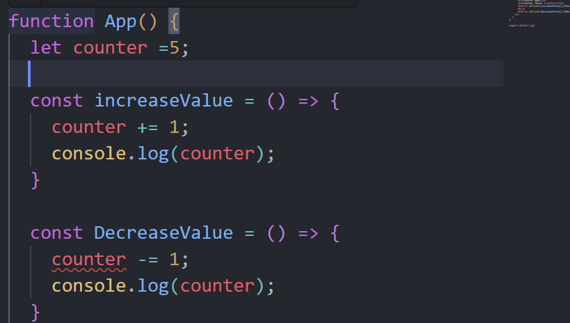
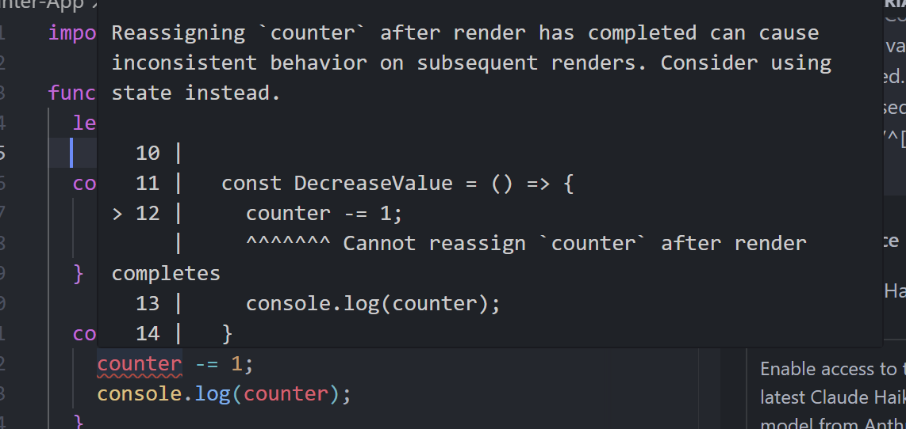
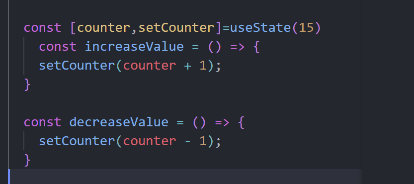
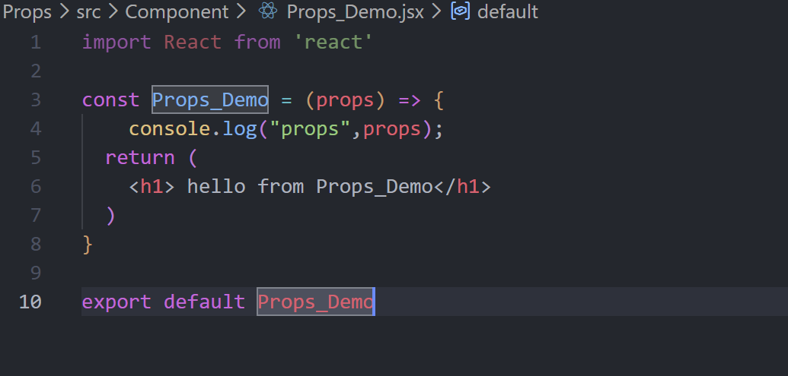
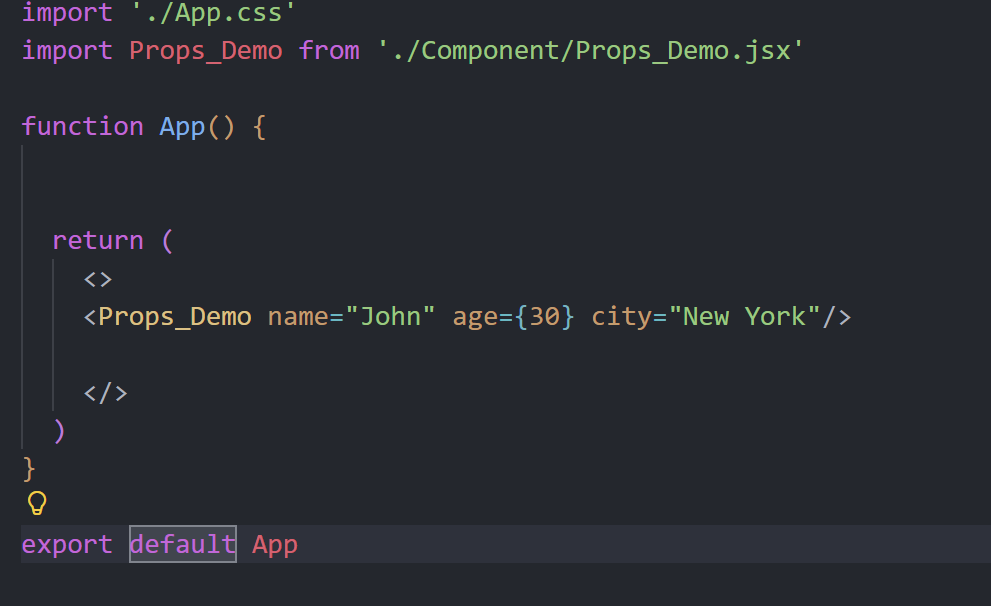
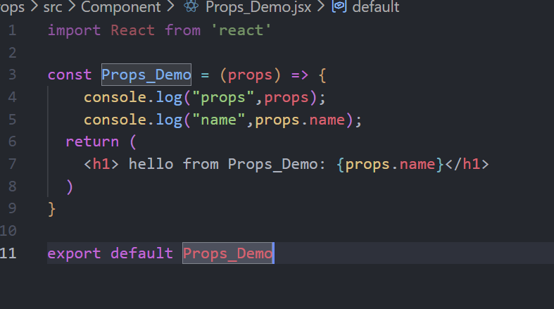
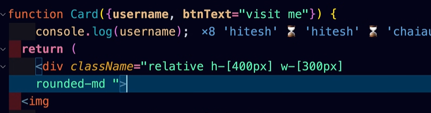
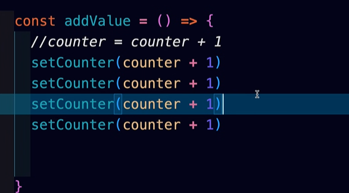

# React Basics – npm, Vite, Project Structure & SPA

---

## 1. npm and npx

- **npm (Node Package Manager)**  
  Used to install, manage, and maintain dependencies (packages) in a Node.js / React project.

- **npx (Node Package Executor)**  
  Used to execute packages directly without globally installing them.

---

## 2. `package.json` Scripts (React)

```json
start        -> Used to start the project in development mode
build        -> Used to generate production-ready files
lint         -> Used for code quality, optimization, and catching errors
browserslist -> Defines which browsers the web app should support
```

---

## 3. Running a React Project

```bash
npm start
# or
npm run start
```

### Build Command

```bash
npm run build
```

- Generates a **`build/`** folder
- This folder contains **all static files** (HTML, CSS, JS)
- Entire React code is converted into optimized JavaScript
- In **production**, users are served files from the **build folder**, not the `src` folder

---

## 4. Creating a React Project

### Using Create React App (CRA)

```bash
npx create-react-app app_name
```

- Slower because it installs all bundles and dependencies at once
- Uses `react-scripts`

### Using Vite (Recommended)

```bash
npm create vite@latest
cd app_name
npm run dev
```

- Faster than CRA
- Lightweight
- No `react-scripts`

---

## 5. How React Injects into HTML

### Flowchart

```
public/index.html
        |
        v
<div id="root"></div>
        |
        v
src/index.js
        |
        v
<App /> (App.jsx)
```

### Explanation

- React creates its **own virtual DOM**
- React attaches itself to the root div using:

```js
ReactDOM.createRoot(document.getElementById('root'))
```

---

## 6. Project Structure (Create React App)

### Important Files

#### `package-lock.json`
- Locks the **exact versions** of dependencies
- Ensures consistency across different machines

#### `package.json`
- Contains project metadata
- Lists required dependencies
- Defines scripts

---

### `public/` Folder

- `index.html` → Main and only HTML page
- `logo` → Static assets
- `manifest.json` → Used for mobile/PWA support
- `robots.txt` → Used by search engines (SEO)

---

### `src/` Folder

- `index.js` → Entry point of React
- `App.js / App.jsx` → Root component

---

## 7. Vite Project Structure Difference

- Does **not** use `react-scripts`
- React is injected directly using:

```html
<script type="module" src="/src/main.jsx"></script>
```

- Faster development and build process

---

## 8. Why React is a SPA (Single Page Application)

- React has **only one HTML file**:

```text
public/index.html
```

- Page does not reload
- Content updates dynamically using JavaScript and Virtual DOM

---

## 9. React Scripts

- `react-scripts` is responsible for:
  - Injecting React into HTML
  - Development server
  - Build optimization
  - Babel and Webpack configuration

---

## 10. JSX Rules

- **Component names must start with an Uppercase letter**

```jsx
function MyComponent() {}
```

- A component must return **only one parent element**

### Correct Ways

```jsx
return (
  <div>
    <h1>Hello</h1>
    <p>World</p>
  </div>
)
```

### Using Fragment

```jsx
return (
  <>
    <h1>Hello</h1>
    <p>World</p>
  </>
)
```

- `<> </>` is called a **Fragment**
- Used to avoid unnecessary `<div>` wrappers

---

## 11. Summary Flow (React App Lifecycle)

```
Code (JSX)
   ↓
React Components
   ↓
Virtual DOM
   ↓
Real DOM (Browser)
```
# React Internals & JSX – Complete Notes

---

## 1. Why this gives ERROR (Custom ReactElement Object)

```
this will give error
like we make object of ReactElement
so before it in render() function things written like <ReactElement/> or ReactElement()
```

### Explanation
- In React, **we cannot directly render a plain JavaScript object**.
- React expects a **valid React Element**, not just any object.
- Writing `<ReactElement />` or calling `ReactElement()` assumes it is:
  - either a **component** (function/class)
  - or a **React-created element**

### Why error occurs
- Your custom object does NOT have:
  - `$$typeof: Symbol(react.element)`
  - internal metadata required by React
- React performs a check internally to verify:
  > "Is this a React Element?"
- Since your object fails this check, React throws an error.

> ⚠️ Important: **React does not trust user-made objects** for rendering.

---

## 2. Why THIS runs successfully

```
this will run ?? ## but why ??????
when we give this render have some argument as it is function now when we give this other element obejct then it is parse into tree
while we give Reactelement its tree fromation is differnet as we write our own react library.
```

### Explanation
- `render()` expects a **valid React Element object**
- When we use `React.createElement()`:
  - React creates an object in a **specific internal format**
  - That object is then converted into a **Fiber Tree**

### Internal Flow
```
React.createElement()
      ↓
React Element Object (with $$typeof)
      ↓
Fiber Tree Creation
      ↓
DOM Rendering
```

### Key Reason it works
- React itself created the element
- React fully understands the structure
- React can safely parse it into its reconciliation system

---

## 3. React Proper Syntax (JSX)

```
this is react proper syntax it properly works ..
this is react syntax ....
above pic we define our custom
```

### JSX Example
```jsx
<a href="https://google.com">Google</a>
```

### Important Truth
- JSX is **NOT HTML**
- JSX is **NOT directly rendered**
- JSX is converted into JavaScript before execution

---

## 4. Custom React vs Real React (Code)

```javascript
// this is our custom react
const reactelement={
    type:'a',
    props:{
        href:'https://www.google.com',
        target:'_blank',},
        children:'Google Link'
}
```

### Why this fails
- Missing React-specific fields
- Children not placed inside `props.children`
- No identity marker (`$$typeof`)

---

```javascript
// how react done internally
const reactElement =React.createElement(
  'a',
  {href:'https://google.com',target:'_blank'},
  'Google Link'
)
```

### What React Adds Internally
```js
{
  $$typeof: Symbol(react.element),
  type: 'a',
  key: null,
  ref: null,
  props: {
    href: 'https://google.com',
    target: '_blank',
    children: 'Google Link'
  }
}
```

> ✅ This is why React accepts this but rejects custom objects.

---

## 5. How to Inject Variables in React (JSX `{}`)

```javascript
/* any thing in curly braces works as parameter...
 {} called as Expression (evaluated expression)..
 javascript nu final o/p je evalute thai gayu e write kariye..
 now evalution means {if(true) username } we don't write this .
 this things we write outside return .only final evaluted code we write ...

 now why we dont write {if()....}
 coz in reactelement code as we write above all variable are injected at last
 now if valu write kariye then it inject at last and object ni
 kaik syntax to hoy ne . so we dont write it like this..
*/
```

### Function Example
```javascript
function name(){
  const username="prince patel"
  return (
    <>
    <h1>welcome to {username}</h1>
    </>
  )
}
```

### Important Rule
- `{}` accepts **ONLY EXPRESSIONS**
- Expressions return values
- Statements do NOT return values

### Allowed Inside `{}`
```js
{username}
{2 + 2}
{isLoggedIn && "Welcome"}
```

### Not Allowed
```js
{if(condition) {...}}
{for(...) {...}}
```

---

## 6. Why React Disallows `if` Inside JSX

### Reason
- JSX is converted to function calls
- React injects values into `children`
- Statements break object structure

Example Conversion:
```jsx
<h1>{username}</h1>
```
⬇️
```js
React.createElement('h1', null, username)
```

---

## 7. Anchor Tag Output Explanation

```
output is like (click me to visit google chai aur react) whole this as one anchor tag...
```

### Reason
- Everything inside `<a>` becomes `props.children`
- Browser behavior makes entire anchor clickable

---

## 8. Direct JSX Injection & jsx-runtime

```javascript
import {jsx as _jsx} from 'react/jsx-runtime.js'
// now what to write ...
// go to github...
```

### Modern React Reality (React 17+)
- JSX no longer needs `import React from 'react'`
- JSX compiles into `jsx()` instead of `createElement()`

Example:
```jsx
<h1>Hello</h1>
```
⬇️
```js
_jsx("h1", { children: "Hello" })
```

---

## 9. Final Internal Flow (Very Important)

```
JSX
 ↓
jsx() / React.createElement()
 ↓
React Element Object
 ↓
Fiber Tree
 ↓
DOM
```

---

## 10. Final Summary
- JSX is syntax sugar
- React only understands **valid React Elements**
- `{}` allows evaluated expressions only
- Custom objects cannot be rendered directly
- `jsx-runtime` is the modern JSX engine


# Why you need hooks and project


- Reassigning `counter` after render has completed can cause inconsistent behavior on subsequent renders. Consider using state instead.
- can reassign value after rendering ...

```
useState give 2 value as array in o/p like :- [variable ,fucntion]
use for update the react state ...
we get two things 
if we pass  function in react useState() then ????
```

### React and reactiness 
- if we have 4 5 time same variable declare in our app and we try to update it some time 
we see that like we have to write document.getid all for all element in which that variable use 
- in react we update once and UI updation part will handle by React itself..

# Virtual DOM, Fiber & Reconciliation (Deep & Clear Notes)

---

## 1. What happens in **createRoot()** (Behind the Scenes)

When you call:
```js
const root = ReactDOM.createRoot(document.getElementById('root'));
root.render(<App />);
```

### 🔹 High-level idea
- React **does NOT directly update the browser DOM**.
- It first creates an **in-memory tree** (Virtual DOM / Fiber Tree).
- Then it compares the **previous tree** with the **new tree**.
- Only the **changed parts** are updated in the real DOM.

---

## 2. Browser DOM vs Virtual DOM

### ❌ Traditional Browser DOM behavior
- Any UI change → browser may:
  - Recalculate layout
  - Repaint large portions of DOM
- Conceptually feels like **whole page repaint**
- Expensive for large apps

> Browser works directly on the real DOM (slow)

---

### ✅ Virtual DOM behavior (React)
- React keeps a **Virtual DOM tree** in memory
- Every UI is represented as **JavaScript objects**
- On update:
  - New Virtual DOM tree is created
  - Old and new trees are **diffed**
  - Only the **minimum required DOM mutations** are applied

> Real DOM updates become **small, fast, and optimized**

---

## 3. Why Virtual DOM Exists

- Real DOM operations are **slow**
- JavaScript object comparison is **fast**
- React optimizes **what to update**, not **how to update**

Key idea:
> "Track everything, update only what changed"

---

## 4. Example: Button Click Scenario

```js
function Counter() {
  const [count, setCount] = React.useState(0);

  return (
    <button onClick={() => setCount(count + 1)}>
      Likes: {count}
    </button>
  );
}
```

### What happens internally?
1. Button clicked multiple times (3–4 times)
2. `setCount()` triggers updates
3. React does NOT immediately update DOM every time
4. Updates are:
   - Batched
   - Prioritized
   - Scheduled
5. UI updates appear **smooth and optimized**

---

## 5. What is React Fiber?

> **Fiber is NOT Virtual DOM replacement**
> Virtual DOM still exists
> Fiber is the **algorithm + data structure** that updates it

### Official Definition (Simplified)
- React Fiber is a **reimplementation of React’s core reconciliation algorithm**
- It enables:
  - Incremental rendering
  - Prioritization of updates
  - Interruptible rendering

---

## 6. Why React Fiber Was Introduced

Problems with old React (Stack Reconciler):
- Rendering was **synchronous**
- Long updates blocked:
  - Animations
  - User input

Fiber fixes this by:
- Splitting work into **small units**
- Spreading work across **multiple frames**

---

## 7. Key Features of React Fiber

### 🔹 Incremental Rendering
- Rendering work is broken into chunks
- Each chunk fits into a frame

### 🔹 Pause & Resume
- React can pause rendering
- Resume later from same point

### 🔹 Abort Work
- If a higher priority update arrives, old work is discarded

### 🔹 Priority-based Updates
Examples:
- User input → HIGH priority
- Data fetching → LOW priority

### 🔹 Concurrency
- Enables concurrent features like:
  - `useTransition`
  - `Suspense`

---

## 8. Fiber Node (Mental Model)

Each Fiber node represents:
- A component
- A DOM element
- A fragment

Each node contains:
- type
- props
- state
- child
- sibling
- return (parent)

This forms a **linked list tree structure**

---

## 9. Reconciliation (MOST IMPORTANT)

### Definition
> Reconciliation is the process of **diffing one tree with another** to determine what needs to change.

### What React Compares
- Previous Fiber Tree
- New Fiber Tree

### What React Decides
- Create new nodes
- Update existing nodes
- Delete old nodes

---

## 10. Update (Core Concept)

### What is an Update?
- Any change in data used to render UI
- Usually triggered by:
  - `setState`
  - `useState`
  - `useReducer`

### Update Flow
```
setState → Update queued → Fiber scheduled → Reconciliation → DOM commit
```

---

## 11. Declarative Nature of React (Core Philosophy)

React’s BIG idea:

> "Think as if the entire UI re-renders on every update"

### Why this is powerful
- Developer does NOT manage DOM manually
- No thinking about:
  - A → B
  - B → C
  - C → A transitions

React handles:
- Diffing
- Optimization
- Efficient DOM updates

---

## 12. Flowchart: React Update Lifecycle

```
User Action
   ↓
State Update (setState)
   ↓
New Virtual DOM / Fiber Tree
   ↓
Reconciliation (Diffing)
   ↓
Commit Phase
   ↓
Minimal DOM Updates
```

---

## 13. Final Summary (One-Line Concepts)

- Virtual DOM → In-memory UI representation
- Fiber → How Virtual DOM is updated
- Reconciliation → Diffing algorithm
- Update → State/data change
- Declarative UI → You describe WHAT, React decides HOW

---

### ⭐ Golden Line to Remember
> Virtual DOM tells *what changed*, Fiber decides *when and how to apply it*, Reconciliation decides *where to apply it*.


# Props




```javascript
// we dont pass direct value like
<Props_Demo obj={name:prince} arr=[1,2,3]/>
// it will give error what we can do is ..

function App(){
  myobj={
    name:"prince",
    age:30
      }
      newarr=[1,2,3]
      return(
        <>
        <Props_Demo obj={myobj} arr={newarr}/>// it will work we can pass variable 
        </>
      )
}

```




# React interview coding related senario
- after doing increment and decremenrt in interview then next question is like...

- now we do values duplicate now what happen??
```
- at click 1 value is increase not too many time 
- usestate je ui ma update ave ene batches ma send kare variable ma
- now batches ma we send early but uisng Fiber algo we have more controll on batches
- whole thing nu 1 batch bane and same kaam to ek j vaar execute kare so we get increment by 1..

```
## NOW suppose in some situation we have to update like this then what ,,,,
- 
in setcounter we have one callback
```javascript
funtion App(){
  const [counter,setCounter]=useState(5)
  const addValue=()=>{
    setCounter((prevCounter)=>prevCounter+=1)//here prevcounter give prevouse updated counter value
    setCounter((Counter)=>Counter+=1)// also give whatever we have to give...
    // for good practice we give same parameter name to all..
    setCounter((prevCounter)=>prevCounter+=1)
  }
}
```
-------------------------------------------------------

